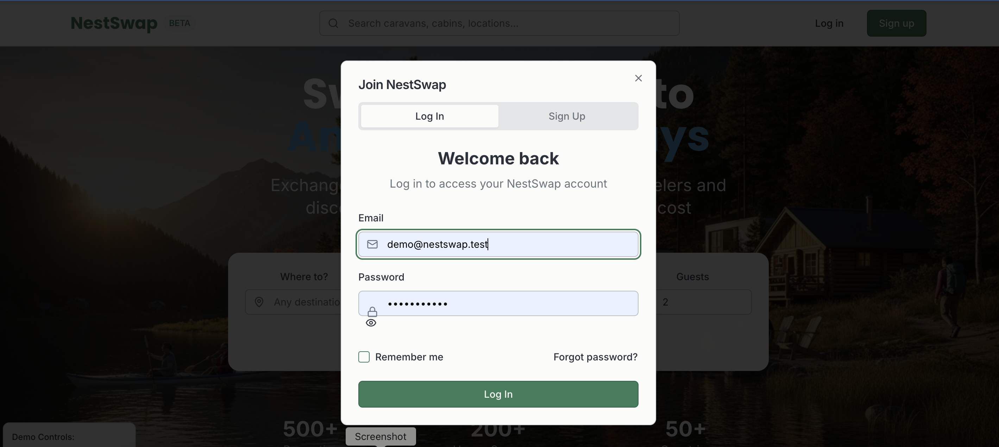
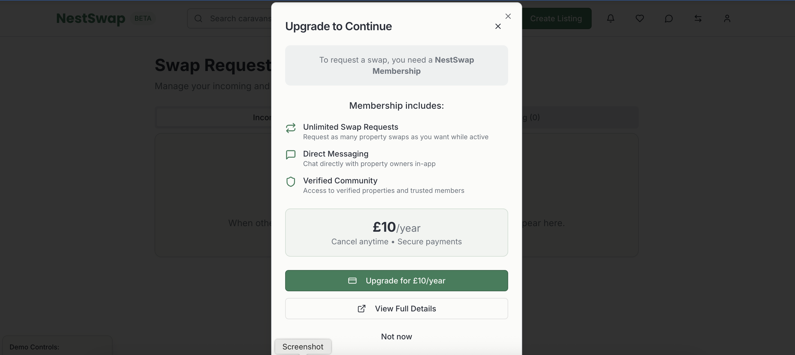
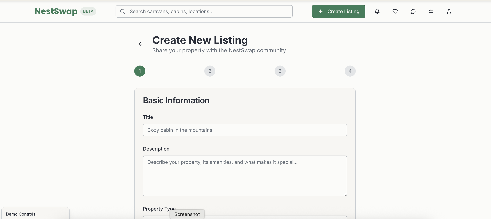
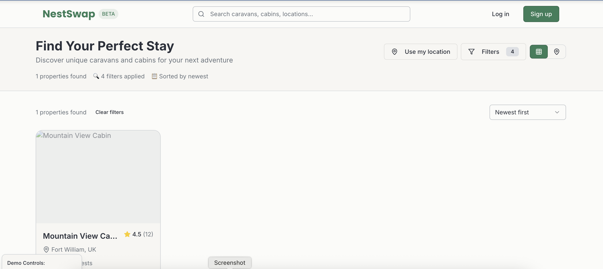
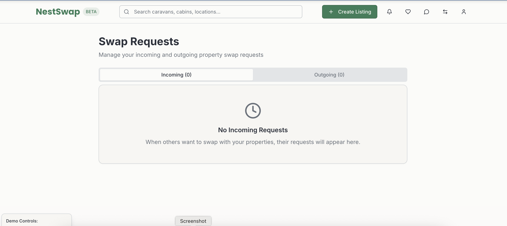

# NestSwap — Caravan & Cabin Exchange Platform

Browse unique caravans and cabins worldwide. **Browsing is free.**  
Upgrade to **Premium (£10/year)** to **create/edit listings**, **message owners**, and **request exchanges**.

**Live demo:** https://269eb9cb-fef6-4108-a002-7b023e752de8-00-23hh79byt9ivk.janeway.replit.dev/  
**GitHub repo:** https://github.com/iosif85/nestswap  
**Portfolio page:** https://iosif85.github.io/

---

## Demo Accounts
- **Premium:** `demo-premium@nestswap.test` / `password123`  
- **Free:** `demo@nestswap.test` / `password123`

> Registration/verification works. If SMTP isn’t configured, verification links print to the backend **Console** (Replit Logs).  
> Stripe is **test mode** only.

---

## Table of Contents
- [Features](#features)
- [Screenshots](#screenshots)
- [Tech Stack](#tech-stack)
- [Architecture](#architecture)
- [Getting Started (Replit)](#getting-started-replit)
- [Getting Started (Local)](#getting-started-local)
- [Environment Variables](#environment-variables)
- [Testing](#testing)
- [Access Control & Membership](#access-control--membership)
- [Admin & Moderation](#admin--moderation)
- [Security Notes](#security-notes)
- [Project Structure](#project-structure)
- [Roadmap / Future Work](#roadmap--future-work)
- [License](#license)

---

## Features
- **Secure Auth** — register, email verification, login, logout, password reset (**JWT in HttpOnly cookies + CSRF**).
- **Profiles** — avatar, bio, country.
- **Listings** — create/edit with photos, amenities, rules, location (map pin), and **per-day availability**.
- **Browse & Search** — keyword, filters, and interactive **map** (Leaflet + OpenStreetMap).
- **Messaging (Premium)** — threaded inbox between owners.
- **Exchanges (Premium)** — request, accept, decline.
- **Premium Membership** — **Stripe** subscription (£10/year) with Checkout, Webhook, and Billing Portal (**test mode**).
- **Admin** — basic moderation for users & listings (activate/deactivate).
- **Design choice** — Nightly prices and price filters are **removed** by design (swap-first model).

---

## Screenshots









---

## Tech Stack
**Frontend:** React (Vite + TypeScript), Tailwind CSS, React Router, React Query, Leaflet/OSM  
**Backend:** Python Flask (REST), SQLAlchemy + Alembic, schema validation  
**DB:** SQLite (MVP)  
**Payments:** Stripe Subscriptions (Checkout + Billing Portal + Webhook, **test mode**)  
**Security:** Argon2/bcrypt password hashing, JWT HttpOnly + CSRF (double-submit), rate limiting, input sanitisation  
**Dev:** Replit, GitHub, Trello, pytest

---

## Architecture
- **Client (SPA):** routes for Auth, Listings (Browse/Detail/New/Edit), Messages (Inbox/Thread), Swaps (New/My), Billing (Upgrade/Success/Cancel), Admin.  
- **Server (API):** blueprints for `auth`, `users`, `listings`, `uploads`, `messages`, `swaps`, `billing`, `admin`.  
- **Data model:** `User`, `Listing`, `Photo`, `Availability`, `Message`, `Swap`.  
- **Images:** stored locally under `backend/static/uploads` (MVP-friendly).

---

## Getting Started (Replit)
1. **Open/Fork** the Replit project.  
2. Add **Secrets** (instead of a `.env` file):  
   - `JWT_SECRET`, `CSRF_SECRET` → long random strings  
   - `FRONTEND_URL` = your Replit URL  
   - `BACKEND_URL`  = same Replit URL  
   - *(Optional)* SMTP + Stripe test keys (see below).  
3. Click **Run** — backend (Flask) and frontend (Vite) start together.  
4. Open the app in a new tab and use the **Demo Accounts** above.

> If SMTP isn’t set: verification & reset links appear in **Replit → Shell → Console output**.

---

## Getting Started (Local)

### Prerequisites
- Python **3.11+**, Node **18+**, Git

### Backend
```bash
cd backend
python -m venv .venv && source .venv/bin/activate   # Windows: .venv\Scripts\activate
pip install -r requirements.txt
cp ../.env.example ../.env   # fill values as needed
alembic upgrade head
python app.py                # http://localhost:5000
Frontend
bash
Copy code
cd ../frontend
npm i
echo "VITE_API=http://localhost:5000" > .env.local
npm run dev                  # http://localhost:5173
Environment Variables
Create .env (project root) from .env.example for local runs, or set these in Replit → Secrets:

ini
Copy code
# App
FLASK_ENV=development
JWT_SECRET=<generate_random>
CSRF_SECRET=<generate_random>
FRONTEND_URL=http://localhost:5173
BACKEND_URL=http://localhost:5000

# Mail (optional in dev; logs to console if absent)
MAIL_SERVER=
MAIL_PORT=
MAIL_USERNAME=
MAIL_PASSWORD=
MAIL_USE_TLS=true
MAIL_DEFAULT_SENDER="NestSwap <no-reply@nestswap>"

# Stripe (Premium membership — optional for assessment)
STRIPE_SECRET_KEY=sk_test_xxx
STRIPE_WEBHOOK_SECRET=whsec_xxx
STRIPE_PRICE_ID=price_xxx
STRIPE_SUCCESS_URL=http://localhost:5173/#/billing/success
STRIPE_CANCEL_URL=http://localhost:5173/#/billing/cancel
STRIPE_BILLING_PORTAL_RETURN_URL=http://localhost:5173/#/billing/manage
Frontend needs:

bash
Copy code
# frontend/.env.local
VITE_API=http://localhost:5000
Stripe testing: use 4242 4242 4242 4242 with any future expiry and any CVC (test mode only).

Testing
bash
Copy code
cd backend
pytest -q
Covers auth happy paths, listing CRUD, premium gates (HTTP 402 for non-subscribers), swaps, webhook effects, and public search (only is_active=true listings).

Access Control & Membership
Free users: browse listings (grid/map) & view details.

Premium (subscription_status in ['active','trialing']): create/edit listings, upload photos, send/receive messages, request/manage exchanges.

Lapse handling: webhook sets a lapsed user’s listings to is_active=false (not deleted). Re-subscribe to continue.

Admin & Moderation
Admin dashboard to view users & listings; toggle visibility.

Roles: user or admin (server-side checks).

Security Notes
Passwords hashed (argon2/bcrypt).

JWT in HttpOnly cookies; CSRF via double-submit token.

Rate limiting on auth/uploads; input sanitisation for user content.

All secrets via environment variables (never committed).

Project Structure
text
Copy code
nestswap/
  backend/
    app.py, config.py, database.py, extensions.py
    models/ (user, listing, photo, availability, message, swap)
    routes/ (auth, users, listings, uploads, messages, swaps, billing, admin, health)
    services/ (email, auth, search, availability)
    static/uploads/
    migrations/
    tests/
  frontend/
    src/
      api/ (client, auth, listings, messages, swaps, billing)
      features/ (auth, listings, messages, swaps, billing, admin)
      components/ (NavBar, Map, AvailabilityCalendar, PaywallModal, etc.)
      routes/
      styles/
Roadmap / Future Work
Object storage + CDN for images; Postgres instead of SQLite; CI/CD pipeline.

Broader automated tests (Playwright/Cypress).

OAuth login, notifications, analytics, improved moderation.

(Optional later) Paid booking flow & Stripe Connect payouts.

License
© 2025 Iosif Miclea. All rights reserved.


